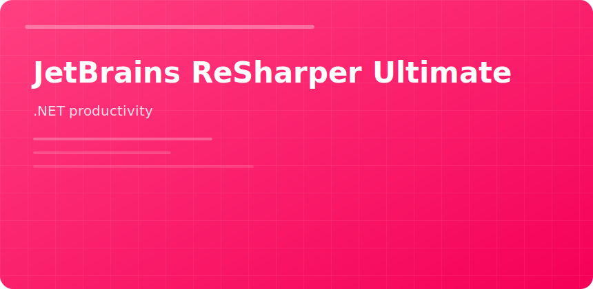

  

  

# JetBrains ReSharper Ultimate

 

ReSharper Ultimate layers **navigation**, **refactors**, and **inspections** onto Visual Studio for teams maintaining large C# solutions.

## Daily wins

- `Ctrl+T` go to everything
- Change signature without manual call-site hunts
- Extract class when god-objects appear
- Solution-wide rename with conflict preview

## Ultimate bundle adds

| Tool | Benefit |
|------|---------|
| dotCover | Coverage in VS test runs |
| dotTrace | CPU snapshots without leaving IDE |
| dotMemory | Leak hunts on long-running services |

## Team policy

Align inspection severity in `.DotSettings` shared via repo—avoid personal-only rule drift.

jetbrains resharper ultimate visual studio csharp refactoring dotnet
